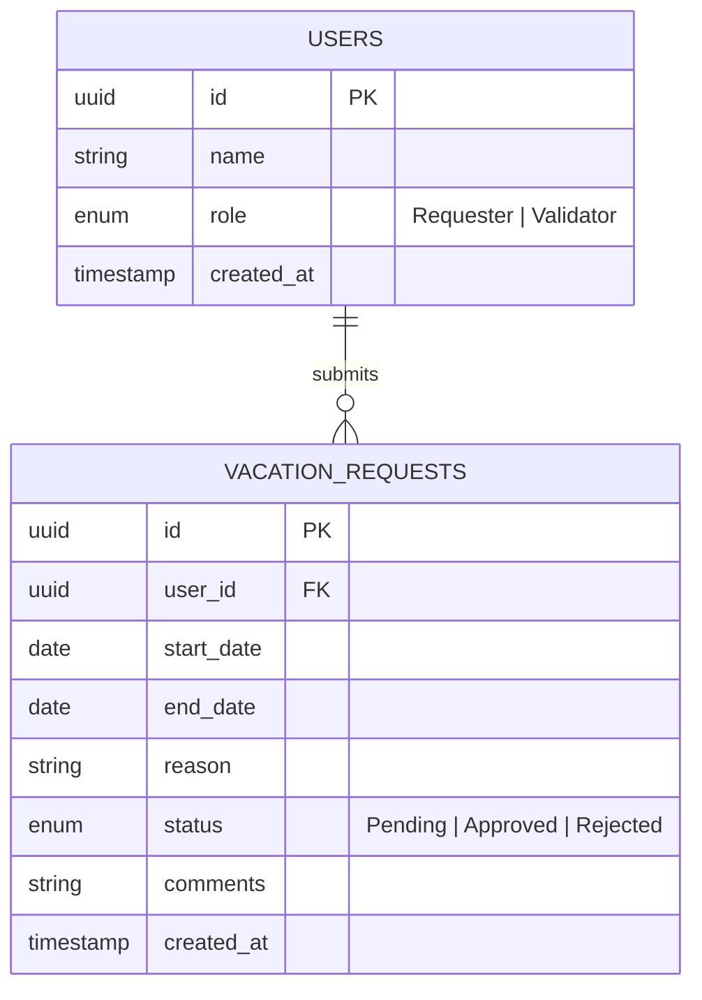
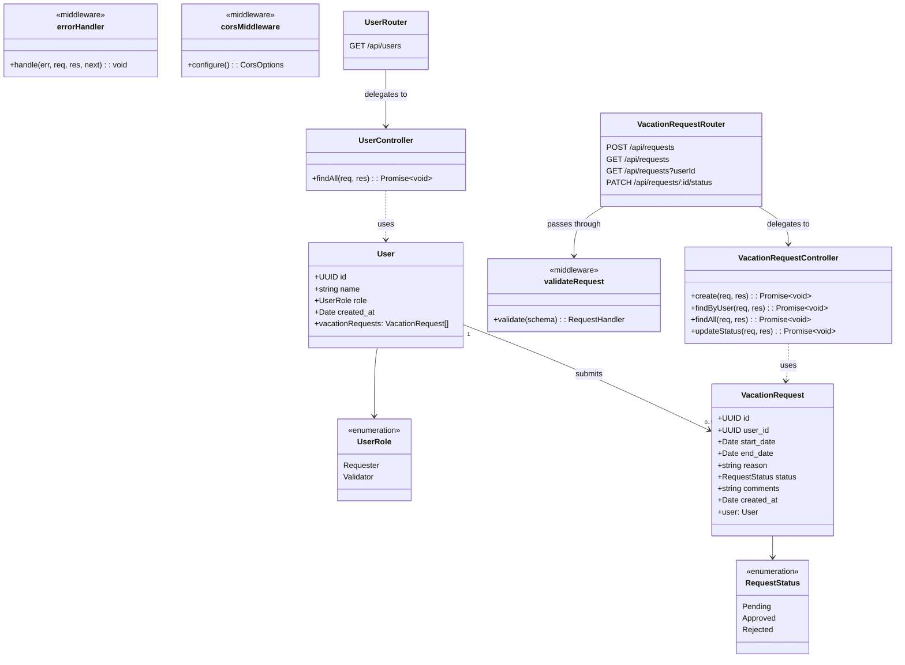
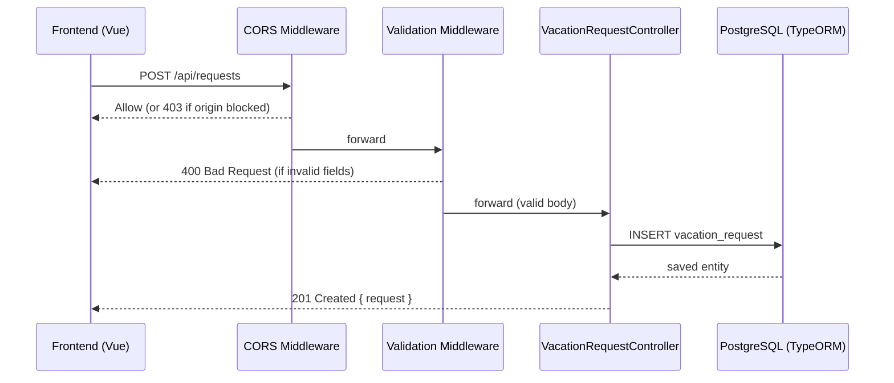
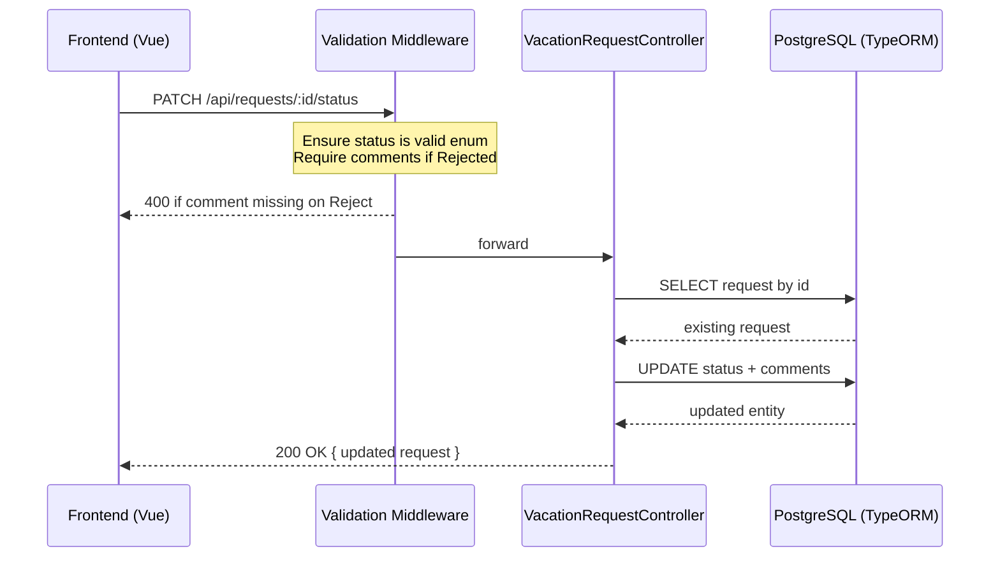

# UML Schema — Vacation Management Interface

---

## Entity Relationship Diagram



---

## Class Diagram — Backend MVC



---

## Request Lifecycle — Submit Vacation Request



---

## Request Lifecycle — Approve / Reject



---

## Backend Folder Structure (MVC)

```
backend/
├── src/
│   ├── entities/              # Models (TypeORM)
│   │   ├── User.ts
│   │   └── VacationRequest.ts
│   ├── controllers/           # Business logic
│   │   ├── userController.ts
│   │   └── vacationRequestController.ts
│   ├── routes/                # Express routers (thin layer)
│   │   ├── userRoutes.ts
│   │   └── vacationRequestRoutes.ts
│   ├── middleware/
│   │   ├── cors.ts            # CORS config
│   │   ├── validate.ts        # Joi/Zod schema validation
│   │   └── errorHandler.ts    # Centralized error responses
│   ├── database/
│   │   └── dataSource.ts      # TypeORM DataSource config
│   └── app.ts                 # Express app entry point
├── tests/
│   ├── vacationRequest.test.ts
│   └── user.test.ts
└── package.json
```

---

## Frontend Structure (Vue 3)

```
frontend/
├── src/
│   ├── views/
│   │   ├── RequesterView.vue  # Submit form + own requests list
│   │   └── ValidatorView.vue  # All requests dashboard + filter + actions
│   ├── components/
│   │   ├── RequestForm.vue
│   │   ├── RequestList.vue
│   │   └── StatusBadge.vue
│   ├── services/
│   │   └── api.ts             # Axios instance + typed API calls
│   ├── router/
│   │   └── index.ts           # Vue Router (/ → Requester, /validator → Validator)
│   └── main.ts
└── package.json
```
